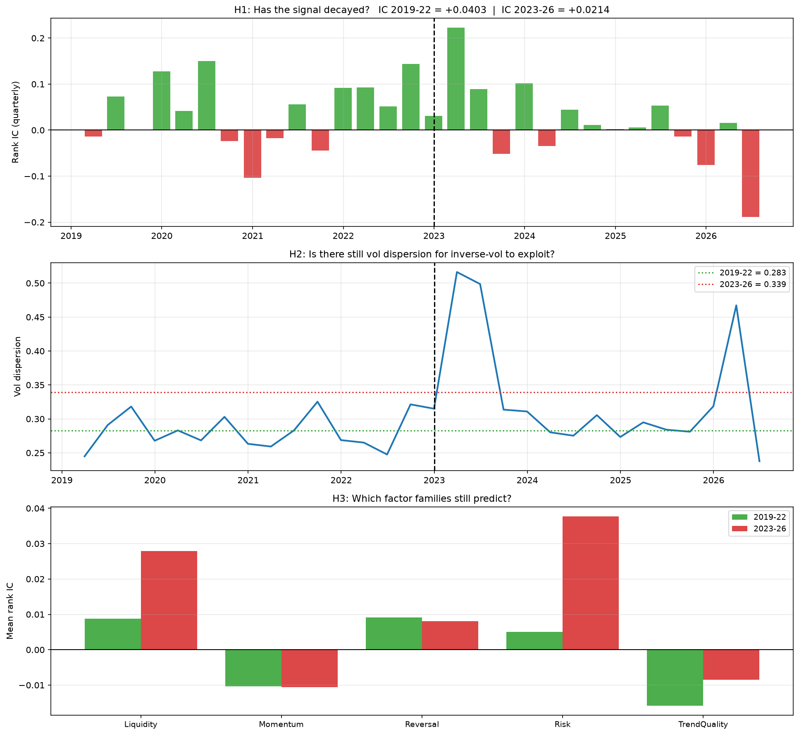

# predictive-engine

A cross-sectional equity ranking system for Indian markets, and the record of the
twenty-five ideas that were tested against it.

> **NAMING.** Every universe has one name, used in code, file names, output and
> current docs: `nifty50`, `nifty100`, `nifty200`, `nifty500`, `midcap50`,
> `midcap100`, `midcap150`, `smallcap250`. The short tags `mid`, `n100` and
> `n50` were retired on 2026-09-18 and are refused with an error that lists the
> valid names. They still appear in dated records, pre-registrations and old
> diagnostics, which are left as written; `mid` there means `midcap150`, `n100`
> means `nifty100` and `n50` means `nifty50`. The rename is recorded in
> [PANEL_MIGRATION.md](PANEL_MIGRATION.md).

Strategy one of a planned series on the same market data. Later
strategies are meant to run against the same universes, the same cost model and
the same verification harness, so that a comparison between them means something.

The engine works and the numbers are below. But the part of this repository worth
your time is `experiments/`. Twenty-five ideas were tested. One was accepted. Every
rejection is written down with the accept rule that was fixed before the run, the
numbers that came back, which gate failed, and what the failure taught. Several of
the corrections in here are corrections to my own earlier claims, left visible with
dates rather than edited out. If you are about to propose an improvement, read
`experiments/EXPERIMENTS.md` first — most of the obvious ones are already closed
with evidence attached.

---

## What it does

Every twenty trading days the model ranks the universe. The top eight names are
held. A held name is sold only when it falls out of the top sixteen, which keeps
turnover down without loosening the selection. Positions are sized inverse to
trailing volatility, and the whole book is then scaled by market breadth — the
fraction of the universe with positive 20-day momentum. When breadth is 0.4, the
strategy deploys 40% of capital and the rest sits in cash earning nothing.

That is why average deployment is 54–56%. It is not an oversight; it is the
exposure rule doing what it was built to do. It also means comparing this to a
fully-invested benchmark on raw CAGR compares two different things, so the tables
below give both sides.

## The model, precisely

LightGBM regressor on cross-sectional rank targets. `n_estimators=400`,
`learning_rate=0.03`, `max_depth=6`, `num_leaves=48`, `subsample=0.8`,
`colsample_bytree=0.8`, `min_child_samples=100`. Ten seeds — `[7, 42, 99, 1, 2, 3,
11, 22, 33, 101]` — averaged. Retrained monthly on an expanding window with a
32-day purge between the training data and the scored month.

Seventeen features, defined as `FEATS_V2` in `results/features_v2.py`: three
momentum (`mom_20`, `mom_120`, `mom_12_1`), two reversal (`rev_5`, `rev_1`), five
volatility and risk (`vol_20`, `vol_ratio`, `idio_vol_60`, `beta_60`,
`downside_vol_60`), three liquidity (`amihud_20`, `turnover_z`, `vol_price_div`),
three trend quality (`trend_consistency_20`, `path_smooth_60`, `dist_high_252`),
and `rsi_14`.

Parameters live in `results/engine_core.py`:

    HORIZON, REBAL, TOP_N, BUFFER, VOL_WIN, PURGE = 20, 20, 8, 16, 60, 32
    SLIPPAGE      = 0.0015
    START_CAPITAL = 1_000_000
    CASH_YIELD    = 0.0

Costs are the real Zerodha delivery-equity schedule — brokerage, STT, stamp duty,
exchange and SEBI fees, GST, and the per-scrip DP charge on sells — computed in
`results/qbeast_in_charges.py`, plus 15 bps of slippage on top. Idle cash earns
nothing, which is deliberate and conservative.

Decisions are made on the close and orders fill at the next open. Nothing in the
pipeline trades on a price it could not have seen.

## Results

### Rebuilt 2026-09-24, and identical on macOS and Linux

Every panel and every published cell was rebuilt on 2026-09-24 after the
feature builder's variance, the CSV float parser and the panel format were
replaced so that macOS arm64, Linux arm64 and Linux amd64 produce identical
bits (see "Running it" and `KNOWN_ISSUES.md`). Window 2019-01-01 to 2026-05-29,
1,836 trading days, from Rs 10,00,000, all figures after costs, cadence 20,
`research` profile. The `tax on` column charges Indian capital-gains tax in the
loop; the buy & hold column is untaxed.

**Read this before any figure below.** A change to the last bits of the
arithmetic, with no change to any strategy rule, moved published figures by up
to 5.9 CAGR points and reversed the sign of two v2 gaps against buy & hold:
midcap100 v2 went from 1.30 points behind its basket to 2.04 ahead, and
smallcap250 v2 from 1.48 ahead to 1.98 behind. Every figure in these tables is
one draw from a distribution. Where that distribution has been measured, the
`n` column gives the number of draws and their spread; every other cell is
marked `n=1` and has no error bar.

#### Nifty 100 (99 constituents) -- tax off

| arm | CAGR% | Sharpe | Sortino | MaxDD% | Calmar | Trades | AnnVol% | Deployed% | FinalEquity | n |
|---|---:|---:|---:|---:|---:|---:|---:|---:|---:|---|
| v1 invvol, 100% invested | 25.71 | 1.25 | 1.63 | -37.52 | 0.69 | 751 | 20.36 | 100.0 | 5442885.74 | n=1 |
| v2 invvol, breadth-scaled | 19.4 | 1.5 | 2.01 | -21.81 | 0.89 | 938 | 12.59 | 56.8 | 3716705.42 | n=10, sd 1.29, 18.74 to 22.79 |
| v3 provol, 100% invested | 27.58 | 1.15 | 1.56 | -40.72 | 0.68 | 726 | 24.06 | 100.0 | 6072338.23 | n=1 |
| v4 provol, breadth-scaled | 20.38 | 1.28 | 1.73 | -26.66 | 0.76 | 930 | 15.69 | 56.8 | 3948930.66 | n=1 |
| buy & hold equal-weight | 24.16 | 1.27 | 1.45 | -38.65 | 0.63 | 0 | 18.67 | 100.0 | 4969254.64 | n=1 |

#### MidCap150 (148 constituents) -- tax off

| arm | CAGR% | Sharpe | Sortino | MaxDD% | Calmar | Trades | AnnVol% | Deployed% | FinalEquity | n |
|---|---:|---:|---:|---:|---:|---:|---:|---:|---:|---|
| v1 invvol, 100% invested | 36.84 | 1.53 | 1.95 | -42.21 | 0.87 | 874 | 22.53 | 100.0 | 10205162.44 | n=1 |
| v2 invvol, breadth-scaled | 28.78 | 1.94 | 2.63 | -21.39 | 1.35 | 1016 | 13.76 | 54.6 | 6510101.81 | n=10, sd 2.23, 26.72 to 33.42 |
| v3 provol, 100% invested | 36.34 | 1.36 | 1.82 | -47.8 | 0.76 | 840 | 25.59 | 100.0 | 9931484.57 | n=1 |
| v4 provol, breadth-scaled | 33.99 | 1.9 | 2.75 | -25.61 | 1.33 | 1012 | 16.37 | 54.6 | 8730268.78 | n=1 |
| buy & hold equal-weight | 25.46 | 1.35 | 1.52 | -37.73 | 0.67 | 0 | 18.42 | 100.0 | 5375524.94 | n=1 |

#### v2 against its own equal-weight buy & hold, all eight universes

The distributions are v2 CAGR% under a 0.01% price perturbation, measured
2026-09-24 on these numerics (`diagnostics/price_noise.txt`). Every tax-on
figure and every buy & hold figure is n=1.

| universe | v2 CAGR% tax off | buy & hold | gap | v2 CAGR% tax on | v2 Sharpe | v2 MaxDD% | v2 trades | n, v2 tax off |
|---|---:|---:|---:|---:|---:|---:|---:|---|
| midcap150 | 28.78 | 25.46 | +3.32 | 24.29 | 1.94 | -21.39 | 1016 | n=10, sd 2.23, 26.72 to 33.42 |
| nifty100 | 19.40 | 24.16 | -4.76 | 16.46 | 1.50 | -21.81 | 938 | n=10, sd 1.29, 18.74 to 22.79 |
| nifty50 | 13.40 | 20.67 | -7.27 | 11.41 | 1.11 | -23.11 | 864 | n=1 |
| midcap50 | 20.97 | 24.34 | -3.37 | 17.81 | 1.54 | -22.21 | 865 | n=1 |
| midcap100 | 28.86 | 26.82 | +2.04 | 24.65 | 1.81 | -20.29 | 898 | n=1 |
| nifty200 | 28.21 | 25.54 | +2.67 | 24.06 | 1.82 | -20.41 | 969 | n=1 |
| smallcap250 | 25.17 | 27.15 | -1.98 | 21.23 | 1.82 | -24.47 | 1086 | n=1 |
| nifty500 | 31.14 | 26.09 | +5.05 | 26.32 | 2.07 | -30.83 | 1119 | n=1 |

### SUPERSEDED 2026-09-24 -- produced by the pre-fix numerics

Everything from here to "The execution layer" was produced before 2026-09-24
and is kept as it was, not restated. The rebuilt figures are above.

Two universes are live. Window 2019-01-01 to 2026-06-08, 1,842 trading days, from
a starting capital of Rs 10,00,000. All figures after costs.

**THESE NUMBERS ARE THE ANCHOR, AND THEY ARE WRITTEN DOWN HERE FOR THAT REASON.**
`results_*/metrics/` is gitignored, so until 2026-09-11 the only copy of any live
figure was an untracked directory. It is transcribed here at full precision,
verbatim from `v34_comparison.csv` in `forensic_snapshot_20260911T0100/`, which is
held in two copies on external media with a SHA-256 manifest
(`RETIRED_UNIVERSES-manifest.txt`, removed from the tree on 2026-09-24; `git show
50562ed:RETIRED_UNIVERSES-manifest.txt`). A rebuild that
disagrees with a number below is a finding, not a refresh.

Provenance of this table: engine as of commit `54e9f31` — `adj_close` canonical,
interior-gap tradability guard active, `research` profile, cadence 20. **Every
figure here differs from the ones this README carried before 2026-09-11**, which
were measured on the close-price basis before those two corrections; midcap150's MaxDD
moved most, −18.98% to −15.68%.

### Price noise re-measured 2026-09-24 on the new numerics

The same measurement as the superseded box below, sigma 0.01% only, seeds 101 to
1010, n=10 per universe. Report: `diagnostics/price_noise.txt`; per-run record:
`diagnostics/price_noise_runs.csv`. The sigma 0.50% blocks were not re-run.

| v2, sigma 0.01% | published | mean | sd | min | max | draws above published |
|---|---:|---:|---:|---:|---:|---:|
| nifty100 | 19.40 | 21.21 | 1.29 | 18.74 | 22.79 | 9 of 10 |
| midcap150 | 28.78 | 29.64 | 2.23 | 26.72 | 33.42 | 7 of 10 |

nifty100's published figure is now inside its own range; the old 19.01 was below
the old minimum. 16 of the 20 draws are above the published figure, against 19 of
20 before.

> **SUPERSEDED 2026-09-24.** Everything in this box was measured on the pre-fix
> numerics. The old per-run record is
> `diagnostics/price_noise_runs_superseded_20260924.csv` and the old report is
> `diagnostics/price_noise_superseded_20260924.txt`.
>
> ### READ THIS BEFORE QUOTING ANY v2 FIGURE BELOW
>
> **The shipping arm's published CAGR is not reproducible under changes to the
> price data too small to see, and it is not the centre of its own distribution.**
> Measured 2026-09-20 and 2026-09-21 by `results/price_noise_measure.py`: 50 full
> re-runs of v2 — panel rebuilt, 10-seed ensemble refitted, backtest re-executed —
> on price data perturbed by multiplying `adj_close` by (1 + ε), ε ~ Normal(0, σ),
> drawn per symbol per day. The ten production seeds are held fixed throughout, so
> this dispersion is on top of the seed noise `KNOWN_ISSUES.md` already records.
>
> | | σ | n | published | mean | min | max | sd |
> |---|---|---:|---:|---:|---:|---:|---:|
> | nifty100 v2 | 0.01% | 10 | 19.01 | 20.76 | 19.32 | 22.55 | 1.03 |
> | | 0.50% | 5 | 19.01 | 21.58 | 19.57 | 25.25 | 2.26 |
> | midcap150 v2 | 0.01% | 10 | 27.80 | 29.88 | 27.69 | 32.35 | 1.74 |
> | | 0.50% | 5 | 27.80 | 28.74 | 24.78 | 32.11 | 2.77 |
>
> At σ = 0.01% — a perturbation smaller than the difference between the two price
> panels on 53 of nifty100's 99 names — **19 of the 20 draws across both universes
> came in above the published figure**, and across all 50 cells 43 did
> (p = 1.0e−07). nifty100's 19.01 is still 0.31 points below the minimum of its own
> ten draws. midcap150's 27.80 is not: taking that block from five seeds to ten on
> 2026-09-21 produced 27.69, the first draw below it, so on that universe the
> published figure is an extreme draw and not an unreachable one. On nifty100 at
> n = 10 the sd is 1.03 against the 0.968-point seed-noise floor, so a hundredth of
> a percent on the prices moves the result as much as the whole ensemble does.
>
> **The edge against the basket takes both signs in both universes.** nifty100's
> published −5.15 ranges −7.38 to +1.09 across its 25 perturbed cells; midcap150's
> published +2.34 ranges −0.68 to +7.06 across its 20. The arm beats its basket in
> 2 of 25 nifty100 runs and loses to it in 1 of 20 midcap150 runs.
>
> Mean daily holdings overlap against the unperturbed run falls from 0.662 at
> σ = 0.01% to 0.483 at σ = 0.50% on nifty100, and 0.707 to 0.511 on midcap150.
>
> **Nothing below is deleted or restated.** Every figure in the tables reproduces
> bit-for-bit from the price CSVs and is asserted on every grid start by an
> identity gate. They are legitimate draws. What is measured here is that they are
> extreme draws of their own input distribution, which is a different problem from
> being wrong, and the one that governs how many digits of them can be quoted.
> No mechanism for the one-sidedness is offered; see `KNOWN_ISSUES.md` for what
> was ruled out.

### Nifty 100 — 99 symbols

| arm | CAGR% | Sharpe | Sortino | MaxDD% | Calmar | Trades | AnnVol% | Deployed% | FinalEquity |
|---|---:|---:|---:|---:|---:|---:|---:|---:|---:|
| v1 invvol, 100% invested | 25.77 | 1.26 | 1.68 | -36.03 | 0.72 | 773 | 20.21 | 100.0 | 5461733.57 |
| v2 invvol, breadth-scaled | 19.01 | 1.50 | 2.07 | -21.87 | 0.87 | 940 | 12.33 | 56.8 | 3628639.83 |
| v3 provol, 100% invested | 27.29 | 1.14 | 1.54 | -41.07 | 0.66 | 716 | 24.10 | 100.0 | 5970524.87 |
| v4 provol, breadth-scaled | 21.33 | 1.34 | 1.82 | -24.54 | 0.87 | 934 | 15.62 | 56.8 | 4187801.56 |
| buy & hold equal-weight | 24.16 | 1.27 | 1.45 | -38.65 | 0.63 | 0 | 18.67 | 100.0 | 4969254.64 |

### MidCap150 — 148 symbols

| arm | CAGR% | Sharpe | Sortino | MaxDD% | Calmar | Trades | AnnVol% | Deployed% | FinalEquity |
|---|---:|---:|---:|---:|---:|---:|---:|---:|---:|
| v1 invvol, 100% invested | 36.85 | 1.54 | 1.98 | -40.84 | 0.90 | 850 | 22.37 | 100.0 | 10209897.06 |
| v2 invvol, breadth-scaled | 27.80 | 1.90 | 2.55 | -20.01 | 1.39 | 1006 | 13.65 | 54.6 | 6150398.56 |
| v3 provol, 100% invested | 39.78 | 1.44 | 1.92 | -54.10 | 0.74 | 814 | 25.95 | 100.0 | 11945809.95 |
| v4 provol, breadth-scaled | 34.21 | 1.89 | 2.68 | -24.56 | 1.39 | 1002 | 16.61 | 54.6 | 8840521.94 |
| buy & hold equal-weight | 25.46 | 1.35 | 1.52 | -37.73 | 0.67 | 0 | 18.42 | 100.0 | 5375524.94 |

The shipping arm is v2 (breadth-scaled, inverse-vol). v1 is the always-invested
variant; v3 and v4 are measurement arms on pro-vol sizing and are not shipped.

**The published cap-weighted index is not in this table**, because it is not in
`v34_comparison.csv` and could not be re-sourced from the snapshot. The figures
this README previously carried — NIFTY100 10.93% / 0.69 / −38.10% and
NIFTYMIDCAP150 18.16% / 1.01 / −38.67% — were measured under the previous engine
and are left here **unverified against the current one**, marked rather than
silently reprinted.

> **The chart that stood here has been removed, 2026-09-12.** It was produced by
> `make_combined_universes.py`, which reads `v2FINAL_equity.csv` and the trade
> logs by their canonical names with **no cadence, arm or profile suffix** — so it
> plotted whichever run wrote those files last, and it records nothing about which
> run that was. The table above is transcribed from `v34_comparison.csv`, whose
> name proves its axes; the chart's provenance is not recoverable after the fact,
> and the two read as one artefact. It goes back once that step reads through the
> naming authority. See `KNOWN_ISSUES.md`.

Read those honestly, and read this paragraph before the tables above.

Against the equal-weight buy & hold of its own universe — the harder comparison,
and the one that matters — **the shipping arm now LOSES to its own basket on
nifty100, 19.01 against 24.16, and beats it on midcap150, 27.80 against 25.46.**
That is a sign change on nifty100, not a shrinking edge.

**Neither sign survives a perturbation of the prices too small to see, and that
was measured rather than suspected.** Across 45 full re-runs on 2026-09-20 and
2026-09-21, nifty100's −5.15 ranges −7.38 to +1.09 and midcap150's +2.34 ranges
−0.68 to +7.06; each universe produces the opposite sign in at least one cell.
Both figures above remain what the runs on disk say. Neither should be quoted as
though its sign were established. See the box before the tables and
`KNOWN_ISSUES.md`.

> *Superseded 2026-09-20: this paragraph read "the shipping arm's return edge is
> now 0.43 CAGR points on n100 (24.43 vs 24.00) and 0.89 on mid (29.23 vs 28.34)",
> and before that 2.18 and 1.99. The tables above and these figures are from the
> runs on disk after the 2026-09-18 repoint at
> `Final_Without_Survivorship_Data`; the superseded numbers were measured on the
> previous vendor's prices. Those are two vendors' prices for the same names over
> the same window, so neither set checks the other and the move is not a
> correction of an error. It is not attributed further: see
> `PANEL_MIGRATION.md` §4, which records the same ten-arm comparison and states
> that midcap150 v3's drawdown move, −29.60 to −54.10, has not been investigated.*

No measured noise floor exists to test any of these gaps against — see
`diagnostics/seed_noise.txt`, which reports a mismatch and no spread.

**The drawdown result is the part that still holds, and it is weaker than it was.**
nifty100 −21.87% against buy & hold's −38.65%, midcap150 −20.01% against −37.73%:
a little over half the depth on both, not less than half. On midcap150 the return
is still ahead; on nifty100 it is not. That a rule which goes to cash when breadth
collapses cuts drawdown is the part of the claim that survived the repoint.

> *Superseded 2026-09-20: this paragraph read "n100 −18.38% against buy & hold's
> −37.79%, mid −15.68% against −36.54%: less than half the depth, for a return that
> is still ahead." Every arm's drawdown worsened on both universes, buy & hold
> included, which `PANEL_MIGRATION.md` §4 records as uniform in a way the CAGR
> column is not.*

Two universes were retired, and on **2026-09-11 they were deleted** -- code, raw
data and registry entries. Their figures are kept here because the experiment
record refers to them constantly. The terminal record, including the full-precision
tables and a SHA-256 manifest of every surviving artefact, was RETIRED_UNIVERSES.md;
it was removed from the tree on 2026-09-24 and is in git history (`git show
50562ed:RETIRED_UNIVERSES.md`). The two universes were known by their sizes, 58 and
74, and the table keeps those names because the experiment record uses them.

| universe | window | CAGR | Sharpe | MaxDD | own equal-weight buy & hold |
|---|---|---|---|---|---|
| 58 (deleted 2026-09-11) | 2019-01-01 → 2026-06-08 | 17.01% | 1.39 | −14.34% | 18.02% |
| 74 (deleted 2026-09-11) | 2019-01-01 → 2025-12-23 | 16.25% | 1.43 | −17.85% | 23.78% |

Both lost to their own buy & hold on return. On 74 it is not close. That is here
rather than quietly dropped, because those two universes are where most of the
experiment record was generated, and a reader should know the ground those
conclusions were measured on.

## The execution layer, and what it is worth

`nautilus/` holds a port of the execution path onto NautilusTrader 1.228. No model
runs inside it. The research pipeline exports `date | symbol | score` to parquet
and the port consumes that; the parquet is the only channel between the two.

The port reconciles against the research engine on every rebalance date at zero
tolerance — plain equality on integer share counts, no epsilon. Both live universes
pass:

| universe | 0.01-tick reconciliation | artefact |
|---|---|---|
| midcap150 | 93 of 93 | recorded in `nautilus/NAUTILUS_STATUS.md` |
| nifty100 | 93 of 93 | `diagnostics/nt_verify_n100.txt` |

> *These two counts were measured before the 2026-09-24 numerics rebuild and have
> not been restated. `nautilus/nt_verify.py --universe=<tag>` prints the current
> count; check_all runs it for both universes on every run.*

What that proves: the two implementations are identical in logic. Order lifecycle,
cash accounting, fee computation and decision timing all survive the move into an
event-driven framework.

What it does not prove: the port runs against a synthetic 09:15 quote built from
the day's open, with `QUOTE_DEPTH` set to ten million shares. Every order fills
instantly, in full, at one price, whatever its size. There is no order book — no L2
data exists anywhere in this project, and the depth model that does exist
synthesises levels from median volume rather than reading them. Slippage is a flat
15 bps baked into that quote, the same for a Rs 1,000 order and a Rs 10,00,000 one.
No latency, no queue position, no market impact, no rejection except for cash.

So the execution layer is a faithful simulation of bookkeeping and timing. It is
not a simulation of execution. `NAUTILUS_STATUS.md` says the same in its own words
and lists what would have to happen before real money.

One number from the nifty100 verification is worth quoting because it is unflattering.
At the traded 0.05 tick grid, against the close-valued reference, the port matches
on only 2 of 93 rebalances, with a maximum quantity error of 14.29%. That is the
expected consequence of two documented differences — the reference values the
portfolio at a close the strategy cannot see, and quantity is a floor division by a
tick-snapped price — and against the fair baseline the figure is 89 of 93 with a
maximum error of 0.13%. But the 14.29% is real and it is in the artefact, so it is
here too.

## What is wrong with these results

**Survivorship bias, unresolved.** Every universe is today's index membership
backfilled to 2019. Names dropped or delisted during the window are absent
entirely, so both the strategy and its buy & hold benchmark are inflated by an
unknown amount. `results/survivorship.py` implements a point-in-time switch and it
works, but the mode is `static` and the results above are biased. Rebuilding real
membership from the NSE press-release archive reached 2024-03-28 onward — the last
2.5 years of a 7.6-year backtest. `diagnostics/membership/STATUS.md` records the
whole attempt, including that downloading the complete non-bond archive back to
2016 did not extend coverage by a single day, and that the walk still breaks on a
missing IREDA exclusion that is in no press release on disk.

**The edge is concentrated in very few names.** midcap150 beats its own buy & hold by
1.99 points. Remove LLOYDSME and that becomes +0.02. Remove TATAINVEST as well and
it is −0.30. Those figures are from `experiments/EXP21_EXP22_PREREG.txt`, written
before the experiment that measured them ran. One stock going up 123x is carrying
the result.

**No significance test was ever run on the headline edge.** Not that it failed one
— nobody ran one. Individual experiments carry noise controls and shuffle tests,
and several were rejected on them, but the top-level claim that the strategy beats
its buy & hold has never been tested against a null. Given the concentration above,
treat the edge as suggestive rather than established.



*Quarterly rank IC on the retired 58-name universe: roughly a third of quarters are negative,
and the two halves read +0.0403 and +0.0214. It was generated by
`results/diagnose_decay.py`, which ran on that universe only; both the universe and
the script were deleted on 2026-09-11, so **this figure cannot be regenerated and no
equivalent exists for any current universe.** See `git show
50562ed:RETIRED_UNIVERSES.md`.*

**midcap150 holds positions it could not have bought.** Re-measured 2026-09-20 at
the backtest's own Rs 10,00,000: **12 of 998 fills** with a prior-20-session median
exceed 10% of it (n=1,006 fills in all). The worst is TATAINVEST on 2019-12-26 at
**34.46%**. nifty100 is cleaner: **3 of 932** above 10% (n=940). Modelling depth
properly now costs midcap150 **0.04 CAGR points**, 27.79% to 27.75%, with Sharpe
going 1.90 to 1.89 and 11 orders walking the book (n=1,006 fills, re-run
2026-09-20), and costs nifty100 **0.00 points**, 19.00% to 19.00%, 3 orders walking
(n=940). Details in `diagnostics/liquidity_participation.txt` and
`diagnostics/depth_compare.txt`.

> *Superseded 2026-09-20: this paragraph read "22 of 985 fills", "3 fills of 997",
> and "the worst is AIIL on 2021-06-07 at 1,614% of median daily volume — sixteen
> days of the entire market's volume in that name, in one order." Two things moved.
> The universes were repointed at `Final_Without_Survivorship_Data` on 2026-09-18,
> so the fill counts are from different runs; and AIIL's price file now begins
> 2024-04-23, so the tree holds no 2021 row for it and that order does not exist in
> any current `daily_trades`. The 1,614% was not recomputed smaller — the run that
> produced it cannot be reproduced. Separately, `liquidity_participation.py` had its
> own median-volume definition until 2026-09-20 and now uses the participation cap's;
> measured on the same fills that change moves the aggregate almost not at all
> (midcap150 max 34.458% either way). The depth-model CAGR figures are from
> `depth_compare.py` and are not restated here.* A filter that removed untradeable names was tested
as EXP20 and rejected, failing one sub-period gate by 0.02 Sharpe.

Those depth figures are measured on the Nautilus port, not on the research engine,
so they do not line up exactly with the results table above. The depth cost is
quoted port-to-port -- 27.79% to 27.75% is one system measured twice -- which is
the only way the figure means anything.

> *Superseded 2026-09-20: this paragraph read "the port reads mid at 29.16% where
> the research engine reads 29.18%, and n100 at 25.43% against 25.36%", and quoted
> the depth cost as 1.80 points, 29.16% to 27.36%. `depth_compare.py` was re-run on
> 2026-09-20 against the repointed data and now reports midcap150 27.79% unlimited
> against 27.75% volume, and nifty100 19.00% against 19.00%. The port-versus-engine
> comparison above is not restated: those research-engine figures were measured
> before the repoint too and nobody has re-run them. The depth cost fell from 1.80
> points to 0.04, the unlimited baseline moved with it (29.16 to 27.79), and the
> move is NOT attributed -- swapping only the depth model's volume source changes
> nothing, and reproducing the 2026-09-17 run would need its code as well as its
> data. See `diagnostics/depth_compare.txt`.*

**The trial count is understated.** The pre-registrations maintained a running
count and it drifted. The true number of looks at this dataset is at least 25 and
possibly more. The error runs toward more looks, never fewer, so every
multiple-testing argument in the project was made against a denominator that is too
small.

## The experiment record

`experiments/EXPERIMENTS.md` is the point of this repository. Twenty-six numbered
entries, twenty-five actually run, one acceptance — reducing the held book from
twelve names to eight.

Each entry states what the idea did in enough detail to reimplement it, why it was
worth trying at the time rather than in hindsight, the accept rule quoted verbatim
where a pre-registration survives, the measured result, which gate failed, and what
the failure taught beyond the verdict. Five pre-registrations are kept alongside it
in full, because a summary of a pre-registration is not the same as the
pre-registration — they are the evidence that the rules were written before the
numbers were seen.

Some of what is in there. The exposure and portfolio-construction family is closed
after eight attempts; the Fundamental Law explains why, since IR ≈ IC × √BR and
exposure timing changes neither term. EXP18 fixed a diagnosed IC inversion exactly
as predicted and made performance worse, which means a positive IC does not imply
better performance in this system. EXP22's premise was refuted rather than merely
rejected: no position ever reached 20% of portfolio value, so no weight cap at any
threshold can address midcap150's concentration, and that closes a whole family of
remedies. One experiment, the sizing test, has a pre-registered rule and no
recorded verdict at all, and it is listed that way rather than guessed at.

Inverse-vol sizing, which is in production and carries real money, went from 4/4 to
1/4 on its own validation suite after a data bug was fixed. That is recorded in the
engines' own `validation_status` block and is the one open question touching a live
component.

If you are about to propose an idea, it is probably in there.

## Repository layout

    results/          the research engine: features, model, walk-forward, backtest,
                      charts, and the survivorship switch
    nautilus/         the NautilusTrader port, its verification harness, and
                      NAUTILUS_STATUS.md
    experiments/      EXPERIMENTS.md, five pre-registrations, and the two restored
                      early test records
    diagnostics/      measured findings: liquidity, depth, tick behaviour, equity
                      reconciliations, and the membership rebuild
    docs/             published copies of two pipeline figures, for this README
    data/reference/   NSE press-release manifest, symbol rename map, circular index
    run_all.py        the whole pipeline, ordered, with a static check that no step
                      reads a file a later step writes

Not tracked, and why: `venv/`, everything under `results*/metrics/`,
`nautilus/reports/`, the score parquets and `cache/` are all rebuilt by
`run_all.py`. `cache/<universe>/` holds the score and raw panels (parquet) and the
constituent farm (hard links to the source CSVs, or copies where a hard link cannot
be made); a panel is reused only while its sidecar's content key matches the source
CSVs and the code that builds it, so adding, removing or editing a CSV forces a
rebuild.

## The price data

**The price data is not in this repository and cannot be downloaded from anywhere
public. It comes from the owner of this repository: ask them for a copy.** It is
vendor OHLCV, not redistributed here, and nothing runs without it.

The pipeline reads exactly one folder, 876 MB, 1,392 CSV files. Put it at this path,
with these eight subfolders, one per universe:

    data/raw/Final_Without_Survivorship_Data/
        Final_NIFTY50_EoD_Data/            nifty50       51 CSV   (50 constituents + Nifty 50.csv)
        Final_NIFTY100_EoD_Data/           nifty100     100 CSV   (99 + NIFTY 100.csv)
        Final_NIFTY200_EoD_Data/           nifty200     198 CSV   (197 + NIFTY 200.csv)
        Final_NIFTY500_EoD_Data/           nifty500     496 CSV   (495 + NIFTY500.csv)
        Final_NIFTYMidCap50_EoD_Data/      midcap50      50 CSV   (49 + NIFTY MIDCAP 50.csv)
        Final_NIFTYMidCap100_EoD_Data/     midcap100     99 CSV   (98 + NIFTY MIDCAP 100.csv)
        Final_NIFTYMidCap150_EoD_Data/     midcap150    149 CSV   (148 + NIFTY MIDCAP 150.csv)
        Final_NIFTYSmallCap250_EoD_Data/   smallcap250  249 CSV   (248 + NIFTY SMLCAP 250.csv)

Each folder holds one CSV per constituent, named by NSE symbol (`ABB.csv`), and one
for the published index. A universe's constituents are whatever CSVs are in its
folder, so an extra or missing file changes that universe and every figure on it.
For one universe only, copy just its folder; for the published figures, all eight.
Other folders the owner's copy may have under `data/raw/` are not read by anything.

**Check your copy before running anything:**

```
python3 check_data.py
```

It compares every file against the tracked manifest `data/RAW_DATA_SHA256.txt`
(SHA-256 per file) and exits 0 only if all 1,392 match and no extra file is present;
otherwise it lists each missing, different or extra file. It needs only the Python
standard library. With a one-universe copy it reports the other folders as missing,
which is expected; `shasum -a 256 -c data/RAW_DATA_SHA256.txt` then shows that the
folder you have is exact.

## Running it

**Platforms.** Verified byte-identical on 2026-09-24 on macOS arm64 (Mac mini M4, Python 3.12.13) and on Linux arm64 and Linux amd64 (Docker `python:3.12.13` on the same Mac; amd64 runs under Rosetta translation, not on a physical Intel or AMD CPU). For a midcap50 v2 run, the score and raw panels and every CSV match byte for byte, the Nautilus reports match once their random identifier columns (`event_id`, `position_id`, `init_id`) are dropped and rows sorted, and the charts match pixel for pixel. **Windows is untested.** Nothing in the code needs a symlink any more and `.gitattributes` stops line-ending conversion, but no run has been made on Windows. On Windows the venv interpreter is `venv\Scripts\python.exe`.

**Linux prerequisites:** git, and Python 3.12.13 with its venv module (on Debian
or Ubuntu the `python3.12-venv` package). The official Docker image
`python:3.12.13` has both; the floating tag `python:3.12` is a later patch release.

```
git clone https://github.com/sidharthjatt/predictive-engine.git
cd predictive-engine
# copy the price data into data/raw/ -- see "The price data"
python3 check_data.py
python3.12 -m venv venv
./venv/bin/python -m pip install -r requirements.txt -c installed_versions.txt
```

Every direct dependency is pinned exactly in `requirements.txt`, and
`installed_versions.txt` pins the rest. **Use the venv interpreter, not
`python3`**: every step runs in the interpreter that launched the run, and on the
machine this project was built on `python3` is 3.11 with no `lightgbm`.

**One universe and one arm:**

```
./venv/bin/python run.py --universe midcap50 --arm v2
./venv/bin/python run.py --list        # the universes and arms, and the plan, without running
```

`--rebal <days>`, `--tax on` and `--profile tradeable` select the other axes.
Every run writes a folder under `runs/` with its artefacts and `run.log`.

**How long it takes** (Mac mini M4, measured 2026-09-23). The FIRST run of a
universe builds its score panel, which dominates: midcap50 6.5 min, nifty50 8.8,
midcap100 11.9, nifty100 16.0, midcap150 17.0, nifty200 29.6, smallcap250 34.5,
nifty500 74.7 (measured while other work shared the machine; treat them as upper
bounds). A REPEAT run reuses the panel: 13-35 s for one midcap50 cell, across the
48 combinations of arm, tax, profile and cadence swept that day.

**Everything:** `./venv/bin/python run_all.py` runs all eight universes and all
four arms.

`./venv/bin/python nautilus/nt_verify.py --universe=nifty100` runs the
reconciliation (`--universe=midcap150` for the other certified universe;
`--rebal=<n>` reports the port-versus-vectorised gap at another cadence without
gating it). It executes two complete backtests. One run on 2026-08-27 took roughly 30 minutes,
which is an observed duration on a single run rather than a timed benchmark.
