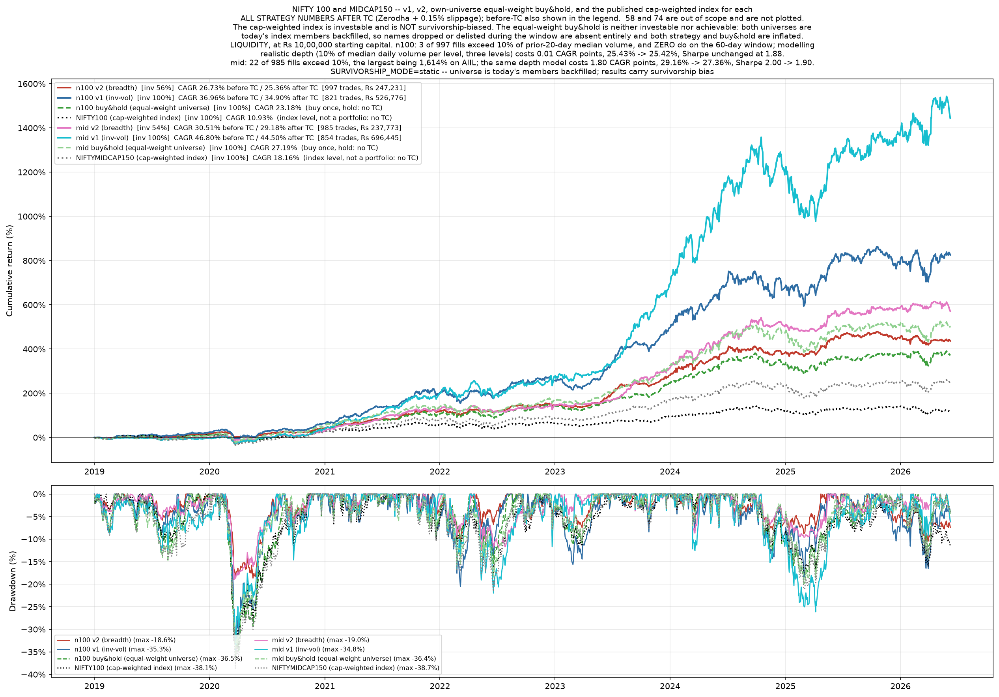

# predictive-engine-s1

A cross-sectional equity ranking system for Indian markets, and the record of the
twenty-five ideas that were tested against it.

Strategy one of a planned series on the same market data — hence `s1`. Later
strategies are meant to run against the same universes, the same cost model and
the same verification harness, so that a comparison between them means something.

The engine works and the numbers are below. But the part of this repository worth
your time is `experiments/`. Twenty-five ideas were tested. One was accepted. Every
rejection is written down with the accept rule that was fixed before the run, the
numbers that came back, which gate failed, and what the failure taught. Several of
the corrections in here are corrections to my own earlier claims, left visible with
dates rather than edited out. If you are about to propose an improvement, read
`experiments/EXPERIMENTS.md` first — most of the obvious ones are already closed
with evidence attached.

---

## What it does

Every twenty trading days the model ranks the universe. The top eight names are
held. A held name is sold only when it falls out of the top sixteen, which keeps
turnover down without loosening the selection. Positions are sized inverse to
trailing volatility, and the whole book is then scaled by market breadth — the
fraction of the universe with positive 20-day momentum. When breadth is 0.4, the
strategy deploys 40% of capital and the rest sits in cash earning nothing.

That is why average deployment is 54–56%. It is not an oversight; it is the
exposure rule doing what it was built to do. It also means comparing this to a
fully-invested benchmark on raw CAGR compares two different things, so the tables
below give both sides.

## The model, precisely

LightGBM regressor on cross-sectional rank targets. `n_estimators=400`,
`learning_rate=0.03`, `max_depth=6`, `num_leaves=48`, `subsample=0.8`,
`colsample_bytree=0.8`, `min_child_samples=100`. Ten seeds — `[7, 42, 99, 1, 2, 3,
11, 22, 33, 101]` — averaged. Retrained monthly on an expanding window with a
32-day purge between the training data and the scored month.

Seventeen features, defined as `FEATS_V2` in `results/features_v2.py`: three
momentum (`mom_20`, `mom_120`, `mom_12_1`), two reversal (`rev_5`, `rev_1`), five
volatility and risk (`vol_20`, `vol_ratio`, `idio_vol_60`, `beta_60`,
`downside_vol_60`), three liquidity (`amihud_20`, `turnover_z`, `vol_price_div`),
three trend quality (`trend_consistency_20`, `path_smooth_60`, `dist_high_252`),
and `rsi_14`.

Parameters live in `results/engine_core.py`:

    HORIZON, REBAL, TOP_N, BUFFER, VOL_WIN, PURGE = 20, 20, 8, 16, 60, 32
    SLIPPAGE      = 0.0015
    START_CAPITAL = 1_000_000
    CASH_YIELD    = 0.0

Costs are the real Zerodha delivery-equity schedule — brokerage, STT, stamp duty,
exchange and SEBI fees, GST, and the per-scrip DP charge on sells — computed in
`results/qbeast_in_charges.py`, plus 15 bps of slippage on top. Idle cash earns
nothing, which is deliberate and conservative.

Decisions are made on the close and orders fill at the next open. Nothing in the
pipeline trades on a price it could not have seen.

## Results

Two universes are live. Window 2019-01-01 to 2026-06-08, 1,842 trading days, from
a starting capital of Rs 10,00,000. All figures after costs, read from
`results_*/metrics/v2FINAL_equity.csv`.

Nifty 100 — 99 symbols, average deployment 56%

| series | CAGR | Sharpe | MaxDD |
|---|---|---|---|
| strategy (breadth-scaled) | 25.36% | 1.88 | −18.64% |
| always-invested variant | 34.90% | 1.65 | −35.32% |
| equal-weight buy & hold of the same universe | 23.18% | 1.30 | −36.52% |
| NIFTY100 index | 10.93% | 0.69 | −38.10% |

MidCap150 — 148 symbols, average deployment 54%

| series | CAGR | Sharpe | MaxDD |
|---|---|---|---|
| strategy (breadth-scaled) | 29.18% | 2.00 | −18.98% |
| always-invested variant | 44.50% | 1.79 | −34.78% |
| equal-weight buy & hold of the same universe | 27.19% | 1.48 | −36.40% |
| NIFTYMIDCAP150 index | 18.16% | 1.01 | −38.67% |

*Both live universes, 2019–2026: breadth-scaled strategy, always-invested variant,
equal-weight buy & hold of the same universe, and the cap-weighted index. Lower
panel is drawdown.*

Read those honestly. Against the published index the gap is large, but the index
is cap-weighted and the strategy is not, so much of that is a weighting difference
rather than skill. Against the equal-weight buy & hold of its own universe — the
harder comparison, and the one that matters — the edge is 2.18 points on n100 and
1.99 on mid. The drawdown improvement is the more defensible result: roughly half
the depth for a higher return, which is what a rule that goes to cash when breadth
collapses ought to produce.

Two universes are retired. They were dropped mid-project during EXP18 and are kept
because the experiment record refers to them constantly:

| universe | window | CAGR | Sharpe | MaxDD | own equal-weight buy & hold |
|---|---|---|---|---|---|
| 58 (retired) | 2019-01-01 → 2026-06-08 | 17.01% | 1.39 | −14.34% | 18.02% |
| 74 (retired) | 2019-01-01 → 2025-12-23 | 16.25% | 1.43 | −17.85% | 23.78% |

Both lost to their own buy & hold on return. On 74 it is not close. That is here
rather than quietly dropped, because those two universes are where most of the
experiment record was generated, and a reader should know the ground those
conclusions were measured on.

## The execution layer, and what it is worth

`nautilus/` holds a port of the execution path onto NautilusTrader 1.228. No model
runs inside it. The research pipeline exports `date | symbol | score` to parquet
and the port consumes that; the parquet is the only channel between the two.

The port reconciles against the research engine on every rebalance date at zero
tolerance — plain equality on integer share counts, no epsilon. Both live universes
pass:

| universe | 0.01-tick reconciliation | artefact |
|---|---|---|
| mid | 93 of 93 | recorded in `nautilus/NAUTILUS_STATUS.md` |
| n100 | 93 of 93 | `diagnostics/nt_verify_n100.txt` |

What that proves: the two implementations are identical in logic. Order lifecycle,
cash accounting, fee computation and decision timing all survive the move into an
event-driven framework.

What it does not prove: the port runs against a synthetic 09:15 quote built from
the day's open, with `QUOTE_DEPTH` set to ten million shares. Every order fills
instantly, in full, at one price, whatever its size. There is no order book — no L2
data exists anywhere in this project, and the depth model that does exist
synthesises levels from median volume rather than reading them. Slippage is a flat
15 bps baked into that quote, the same for a Rs 1,000 order and a Rs 10,00,000 one.
No latency, no queue position, no market impact, no rejection except for cash.

So the execution layer is a faithful simulation of bookkeeping and timing. It is
not a simulation of execution. `NAUTILUS_STATUS.md` says the same in its own words
and lists what would have to happen before real money.

One number from the n100 verification is worth quoting because it is unflattering.
At the traded 0.05 tick grid, against the close-valued reference, the port matches
on only 2 of 93 rebalances, with a maximum quantity error of 14.29%. That is the
expected consequence of two documented differences — the reference values the
portfolio at a close the strategy cannot see, and quantity is a floor division by a
tick-snapped price — and against the fair baseline the figure is 89 of 93 with a
maximum error of 0.13%. But the 14.29% is real and it is in the artefact, so it is
here too.

## What is wrong with these results

**Survivorship bias, unresolved.** Every universe is today's index membership
backfilled to 2019. Names dropped or delisted during the window are absent
entirely, so both the strategy and its buy & hold benchmark are inflated by an
unknown amount. `results/survivorship.py` implements a point-in-time switch and it
works, but the mode is `static` and the results above are biased. Rebuilding real
membership from the NSE press-release archive reached 2024-03-28 onward — the last
2.5 years of a 7.6-year backtest. `diagnostics/membership/STATUS.md` records the
whole attempt, including that downloading the complete non-bond archive back to
2016 did not extend coverage by a single day, and that the walk still breaks on a
missing IREDA exclusion that is in no press release on disk.

**The edge is concentrated in very few names.** mid beats its own buy & hold by
1.99 points. Remove LLOYDSME and that becomes +0.02. Remove TATAINVEST as well and
it is −0.30. Those figures are from `experiments/EXP21_EXP22_PREREG.txt`, written
before the experiment that measured them ran. One stock going up 123x is carrying
the result.

**No significance test was ever run on the headline edge.** Not that it failed one
— nobody ran one. Individual experiments carry noise controls and shuffle tests,
and several were rejected on them, but the top-level claim that the strategy beats
its buy & hold has never been tested against a null. Given the concentration above,
treat the edge as suggestive rather than established.

*Quarterly rank IC on the retired 58 universe: roughly a third of quarters are
negative, and the two halves read +0.0403 and +0.0214. Generated by
`diagnose_decay.py`, which runs on the 58 only — no equivalent figure exists for
either live universe.*

**mid holds positions it could not have bought.** At the backtest's own
Rs 10,00,000, 22 of 985 fills exceed 10% of the stock's prior-20-day median volume.
The worst is AIIL on 2021-06-07 at 1,614% of median daily volume — sixteen days of
the entire market's volume in that name, in one order. Modelling depth properly
costs mid 1.80 CAGR points, 29.16% to 27.36%, with Sharpe going 2.00 to 1.90. n100
is far cleaner: 3 fills of 997 above 10%, and the same depth model costs it 0.01
points. Details in `diagnostics/liquidity_participation.txt` and
`diagnostics/depth_compare.txt`. A filter that removed untradeable names was tested
as EXP20 and rejected, failing one sub-period gate by 0.02 Sharpe.

Those depth figures are measured on the Nautilus port, not on the research engine,
so they do not line up exactly with the results table above. The port reads mid at
29.16% where the research engine reads 29.18%, and n100 at 25.43% against 25.36%.
That gap is the documented difference between the two systems at the traded 0.05
tick grid, described earlier, and it is why the depth cost is quoted port-to-port:
29.16% to 27.36% is one system measured twice, which is the only way the 1.80-point
figure means anything.

**The trial count is understated.** The pre-registrations maintained a running
count and it drifted. The true number of looks at this dataset is at least 25 and
possibly more. The error runs toward more looks, never fewer, so every
multiple-testing argument in the project was made against a denominator that is too
small.

## The experiment record

`experiments/EXPERIMENTS.md` is the point of this repository. Twenty-six numbered
entries, twenty-five actually run, one acceptance — reducing the held book from
twelve names to eight.

Each entry states what the idea did in enough detail to reimplement it, why it was
worth trying at the time rather than in hindsight, the accept rule quoted verbatim
where a pre-registration survives, the measured result, which gate failed, and what
the failure taught beyond the verdict. Five pre-registrations are kept alongside it
in full, because a summary of a pre-registration is not the same as the
pre-registration — they are the evidence that the rules were written before the
numbers were seen.

Some of what is in there. The exposure and portfolio-construction family is closed
after eight attempts; the Fundamental Law explains why, since IR ≈ IC × √BR and
exposure timing changes neither term. EXP18 fixed a diagnosed IC inversion exactly
as predicted and made performance worse, which means a positive IC does not imply
better performance in this system. EXP22's premise was refuted rather than merely
rejected: no position ever reached 20% of portfolio value, so no weight cap at any
threshold can address mid's concentration, and that closes a whole family of
remedies. One experiment, the sizing test, has a pre-registered rule and no
recorded verdict at all, and it is listed that way rather than guessed at.

Inverse-vol sizing, which is in production and carries real money, went from 4/4 to
1/4 on its own validation suite after a data bug was fixed. That is recorded in the
engines' own `validation_status` block and is the one open question touching a live
component.

If you are about to propose an idea, it is probably in there.

## Repository layout

    results/          the research engine: features, model, walk-forward, backtest,
                      charts, and the survivorship switch
    nautilus/         the NautilusTrader port, its verification harness, and
                      NAUTILUS_STATUS.md
    experiments/      EXPERIMENTS.md, five pre-registrations, and the two restored
                      early test records
    diagnostics/      measured findings: liquidity, depth, tick behaviour, equity
                      reconciliations, and the membership rebuild
    docs/             published copies of two pipeline figures, for this README
    data/reference/   NSE press-release manifest, symbol rename map, circular index
    run_all.py        the whole pipeline, ordered, with a static check that no step
                      reads a file a later step writes

Not tracked, and why: `venv/`, everything under `results*/metrics/`,
`nautilus/reports/`, and the score parquets are all rebuilt by `run_all.py`.
`data/raw/` is about 396 MB of vendor OHLCV and is excluded for size — the code
cannot run without it, so it has to come from a backup rather than from here. Six
small files under `data/raw/` are tracked as exceptions: the three index membership
workbooks and their reference cases, plus the reconstructed Nifty 100 membership.
Those cannot be regenerated, because the press-release PDFs they were derived from
were deleted.

## Running it

Python 3.12 or later — `nautilus_trader` requires it. `pip install -r
requirements.txt`, then `python3 run_all.py`.

Two full `--fresh` rebuilds are recorded at 141.9 and 143.9 minutes
(`run_all_ewma2_log.txt`, `run_all_ewma_log.txt`), but both are from a
two-universe pipeline — those runs build the 58 and the 74 only. The current
pipeline builds four universes and has no recorded full-rebuild time. With the
panel caches present the four score-building steps report `cached (skip)` and the
model is not refitted at all.

`python3 nautilus/nt_verify.py --universe=n100` runs the reconciliation. It
executes two complete backtests. One run on 2026-08-27 took roughly 30 minutes,
which is an observed duration on a single run rather than a timed benchmark.
